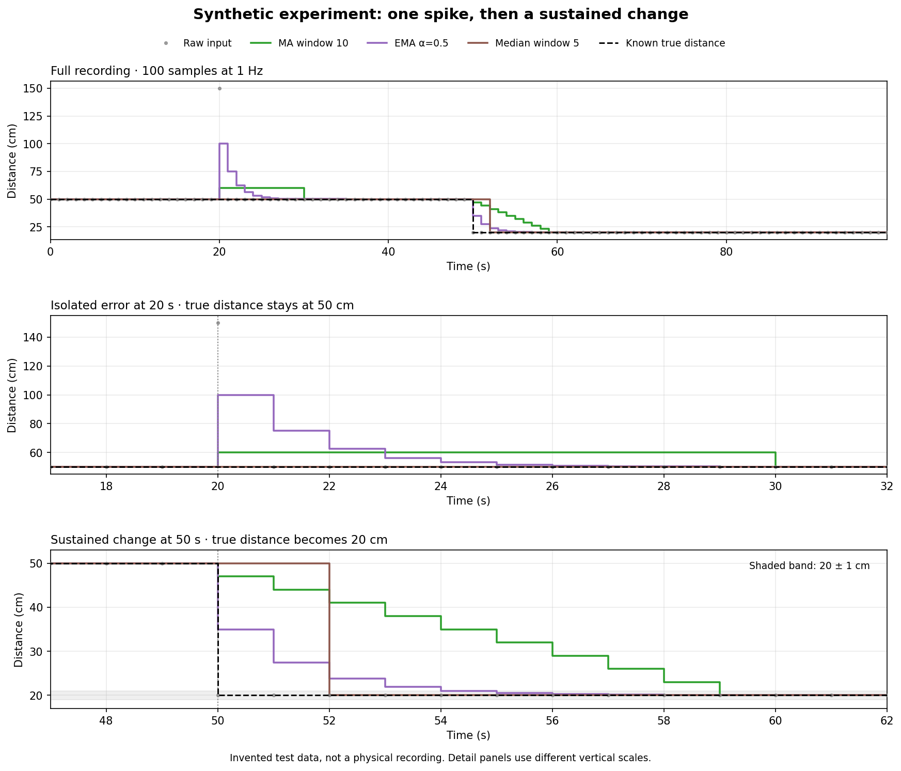

# Ultrasonic Proximity Pipeline

A C++20 learning project that processes saved ultrasonic sensor measurements, compares three filters, and replays filtered distances through a configurable proximity decision. Python generates plots for real recordings and a controlled synthetic experiment.

**Current milestone:** offline log-to-decision processing. Live serial processing and physical motor/brake control are not implemented. The printed brake state is a software decision, not a physical action.

```text
Raw timestamped log → MA / EMA / median → Filtered log
                                             ↓
                                  Three-of-five scanner
                                             ↓
                              Timestamped decision log
```

## What is implemented

- A templated ring buffer with copy/move operations and recent-reading retrieval.
- Moving average (MA), exponential moving average (EMA), and median filters with `update()` and `reset()`.
- A templated `filter_log()` that accepts a filter object by reference.
- A scanner with a constructor-configured threshold in centimeters. With capacity 5, it asserts the brake state when at least three of the latest five readings are strictly below the threshold; equality does not count. It can assert before the window is full once three close readings arrive.
- A log reader that feeds filtered readings to the scanner and saves its decisions.
- Four assertion-based test programs covering selected filter and ring-buffer behavior.
- Plots comparing filters on stationary, moving, and synthetic recordings.

## Inputs and units

Two-column logs contain `timestamp_ms distance_cm`, with no header. Distances are centimeters; plots convert milliseconds to seconds. Hardware recordings have approximately 1,030 ms between readings. The legacy `readings01.log` contains single-column readings and is not compatible with every reader.

The stationary recording used a 50 cm reference placement. The moving recording has no independent time-varying ground truth, so following its raw signal is not proof of physical accuracy.

Files prefixed `synthetic_` are invented experiments, not sensor captures. See [the experiment description](Data/synthetic_spike_step_100.md).

## Results

### Stationary variation

| Method | Standard deviation |
|---|---:|
| Raw | 0.47 cm |
| MA window 3 | 0.33 cm |
| MA window 5 | 0.29 cm |
| MA window 10 | 0.24 cm |
| EMA alpha 0.5 | 0.32 cm |
| Median window 5 | 0.45 cm |

These values use the whole stationary recording. Lower variation does not establish lower bias or better response time. The raw mean is about 49.33 cm against the 50 cm reference.

### Synthetic spike and sustained change

The experiment has 100 readings, one second apart. True distance starts at 50 cm; an erroneous 150 cm reading appears at 20 seconds. True distance changes to 20 cm at 50 seconds and stays there.

| Method | Output at isolated spike (truth: 50 cm) | Delay to within 1 cm of 20 cm after the step |
|---|---:|---:|
| MA window 10 | 60 cm | 9 s |
| EMA alpha 0.5 | 100 cm | 4 s |
| Median window 5 | 50 cm | 2 s |

Delay is measured from the first changed input; a response on that same reading would have zero delay. These results apply to this sequence and these settings, not all sensor conditions.

When the median output is replayed through the scanner with a 25 cm threshold and capacity 5, the first brake assertion is at **54,000 ms**: 2 seconds of median response delay plus 2 seconds to collect three close readings. The saved decision log has 100 rows in this format:

```text
timestamp_ms filtered_distance_cm brake_state
```

The actual file has no header; brake state is `0` or `1`.



[Moving comparison](Data/compare_moving.png) · [Stationary comparison](Data/compare_static50.png)

## Build and run

Requirements: a C++20 compiler and Make. Plotting additionally requires Python 3, NumPy, and Matplotlib.

Run from the repository root:

```bash
make
./scanner
python3 plot_compare.py
```

`scanner` regenerates the outputs configured in `src/main.cpp`, including the synthetic median decision log, and then runs a separate hard-coded scanner benchmark. MA outputs for other window sizes are included as saved artifacts; the current main program does not regenerate every historical MA result. Output files are overwritten when regenerated.

The plotting script writes three images: `compare_moving.png`, `compare_static50.png`, and `compare_synthetic.png`. To show the full real recordings, use `python3 plot_compare.py --seconds 0`. Synthetic plots always show the full experiment plus two event details.

## Run tests

The tests use `assert`; do not compile them with `NDEBUG` enabled. This command builds each test into a temporary directory and runs it:

```bash
test_dir=$(mktemp -d)
for source in tests/*.cpp; do
    binary="$test_dir/$(basename "$source" .cpp)"
    c++ -std=c++20 -Wall -Wextra -Iinclude "$source" -o "$binary" && "$binary" || break
done
```

Successful tests are silent. Current cases cover basic ring-buffer empty/overwrite/order behavior, MA startup/window/reset, EMA updates/reset/alpha boundaries, and median odd/even windows/spike/reset/zero capacity. They are not exhaustive; scanner integration has also been checked against the saved decision rows.

## Code map

- `include/`: filters, ring buffer, scanner, characterization, and log processing.
- `src/main.cpp`: experiment configuration and demonstrations.
- `tests/`: four standalone C++ test programs.
- `Data/`: saved recordings, filtered outputs, decision log, and plots.
- `plot_compare.py`: reusable plotting functions and configured comparisons.

Filter objects retain state; use a fresh object or call `reset()` between independent recordings. Filters run independently on the raw input in these comparisons.

## Limitations and next steps

- Add explicit tests for brake release, threshold equality, scanner capacity constraints, and input failures.
- Define invalid-reading and stale-data behavior before live operation. The analyzer's historical `>= 798` rule is an observed outlier convention; Arduino pulse timeouts in the reviewed capture code yield zero. The filter pipeline currently does not exclude either automatically.
- Improve file-error handling: readers assume well-formed numeric rows, and currently open the output before confirming the input opened successfully. Use distinct input and output paths.
- Add reproducible generation of every comparison configuration and automatic header dependencies to the Makefile. Until then, use `make clean && make` after header-only edits.
- Connect live serial input, record decisions, and demonstrate behavior with a stable sensor mount.

The manual ring-buffer ownership implementation is a learning exercise; copy/move and invalid-capacity edge cases need further verification. Push is O(1); retrieving k recent items is O(k). The desktop benchmark measures software execution, not physical sensing-to-action latency.

## Author

Youssouf — [syf00ysf](https://github.com/syf00ysf)
